# ConfigProject
## 1. Tạo project từ Xcode
## 2. Xác định mô hình hoặc template nếu có.
- Chúng ta cần xác định được nên chọn loại architect pattern nào dựa vào một vài tiêu chí sau đây:

    Sự nhanh nhẹn (agility)  ✅
  
   Dễ dàng phát triển (easy for development) ✅
  
   Kiểm thử (testability) ✅
  
   Hiệu suất (performance) ✅
  
   Khả năng mở rộng (scalability) ✅

   Tái sử dụng mã (code reusable) ✅
   
   ==> Mô hình template ở đây chúng ta sẽ dùng mô mình **MVVM**
   - MVVM: mô hình phổ biến được áp dụng để phát triển một ứng dụng dễ kết hợp, dễ kiểm thử và dễ duy trì.
   - MVVM (Model – View – ViewModel) là mô hình hỗ trợ two-way data binding (ràng buộc dữ liệu) giữa View và ViewModel.
   
   *Model
        Giống như mô hình MVP và MVC, Model trong MVVM là bộ phận đại diện cho các tầng business logic, định nghĩa business rules cho dữ liệu.

   *View
        Đây là nơi cho phép người dùng tương tác, đưa ra yêu cầu.

   *View Model
        Đây là lớp trung gian giữa View và Model và xem như thành phần thay thế cho Controller trong mô hình MVC.

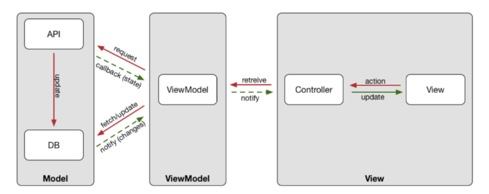

- Template là một mẫu thiết kế đã được layout sẳn có bố cục. Một vài công cụ để tạo template trong IOS như sau: Xcode template,  Xcodegen, Cookicutter...
+ Xcode Template:
-    XCode Templates là một công cụ để tạo các file chứa đoạn mã giúp tối ưu hiệu suất làm việc.
-   B1:
    + Xác định mô hình dự án đang sử dụng, ở đây chúng ta bắt đầu với MVVM
    + Như cách thông thường chúng ta tạo File bằng cách tạo ra từng file : ViewController + .xib, model, ViewModel..
    + Thay vào đó chúng ta có thể custom Xcode template riêng để xử dụng và bắt đầu cấu hình file dự án bằng cách custom.
    
-   B2:
    + Đi tới thư mục: `/Applications/Xcode.app/Contents/Developer/Library/Xcode/Templates/File\ Templates` , đây là nơi chứa các file cấu hình cho template của bạn
- B3:
    + Tạo Folder :
    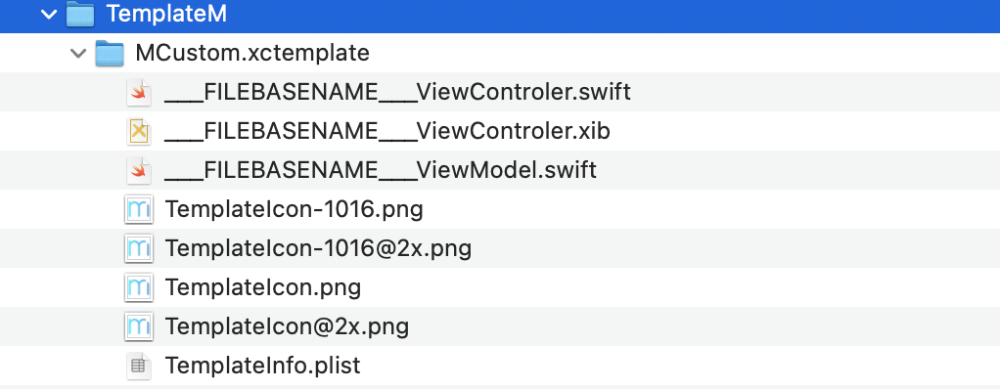
    + cấu hình folder MVVM: ViewControler, .xib, ViewModel, Icon template, info.plist
- B4: 
    + Tệp TemplateInfo.plist chứa mô tả template cơ bản. Việc triển khai bên dưới cung cấp cho chúng ta khả năng nhập tên Mô-đun trong khi tạo các template ứng dụng XCode.
    + Triển khai trong ViewController:
    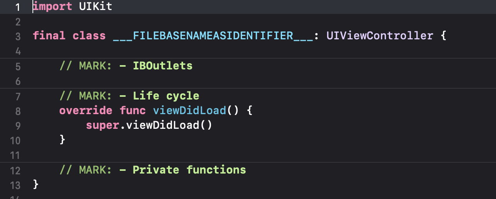
    + Triển khai viewModel
    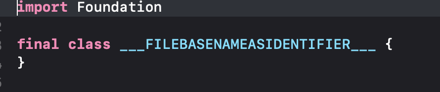

-Sử dụng:
    +   Vào xcode, New File:
    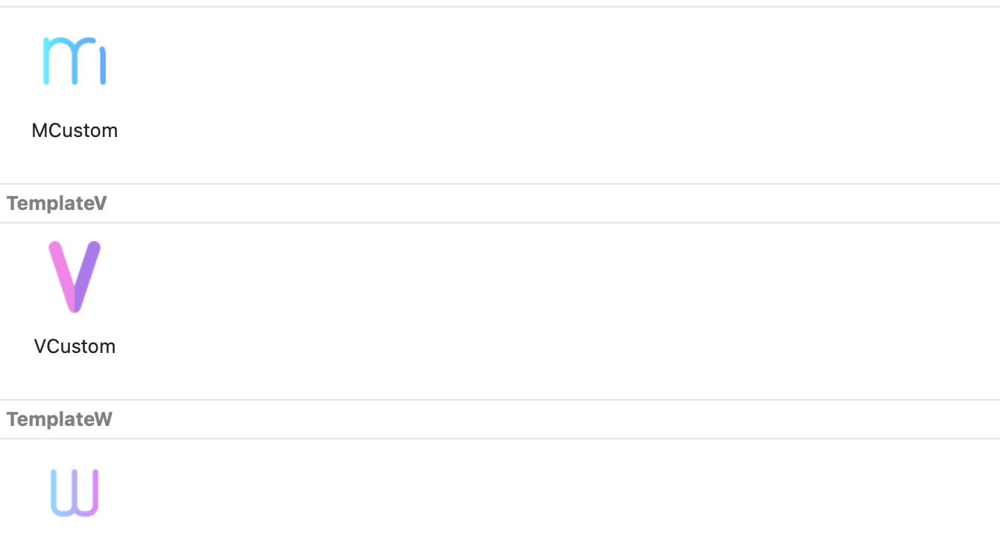
    +  Chọn template mà bạn muốn sử dụng.
## 3. Setup các Package Manager(SPM, Cocoapods, Carthage)
-   Cocoapods:
    + Home-brew
    + Install rbenv or rvm
    + Install ruby
    + Bundle
    + Bundle init
    + Pod

## 4. Cấu trúc lại các folder trong project.

## 5. Cấu hình các môi trường cho dự án. (Dev, STG, PRO)

-   Cấu hình môi trường **Dev**, **Staging**, **Production**
-   Tạo file config **Dev.xcconfig**, **Staging.xcconfig**, **Production.xcconfig**
-   Cấu hình **Dev.xcconfig** ,  **Staging.xcconfig**
    + 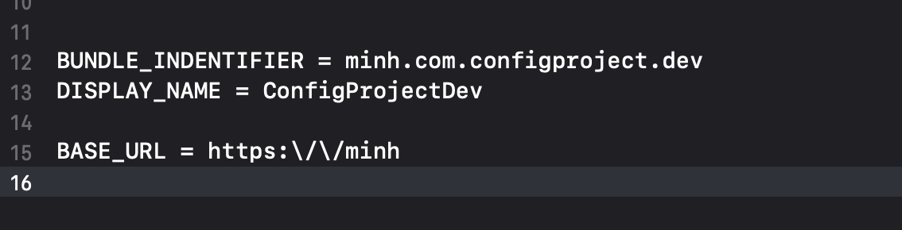
    + 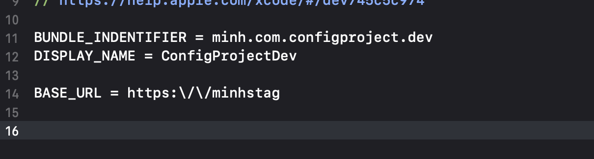
-   Cấu hình trong file info.plist:
    + 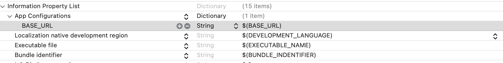
-  Create file config: 
    +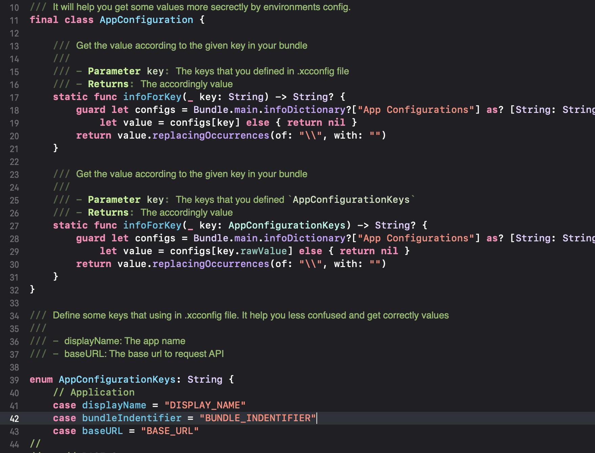
-   Tạo Scheme cho từng môi trường:
    + 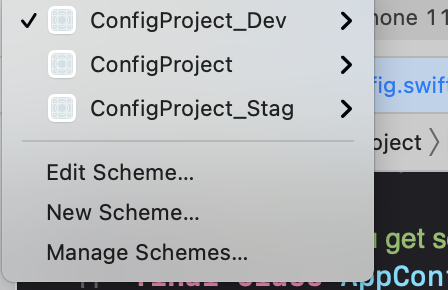
    + 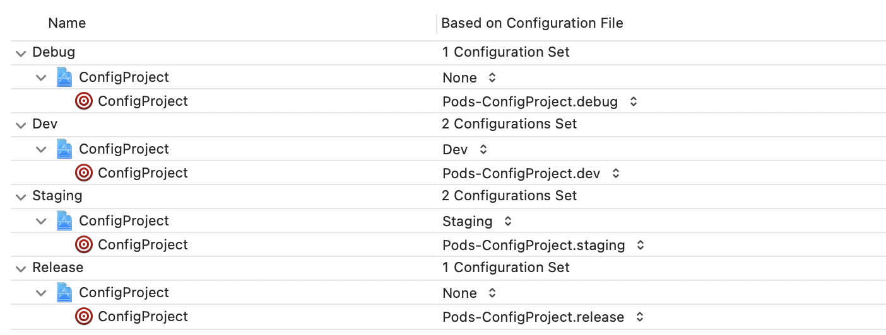

## 6. Define các key, text và color

## 7. Config swiftlint, fastlane, deploygate cho project

## 8. Thiết lập auto deploy TravisCI
- CI là Continuous Integration.

    Nó là phương pháp phát triển phần mềm yêu cầu các thành viên của team tích hợp công việc của họ thường xuyên, mỗi ngày ít nhất một lần. Mỗi tích hợp được “build” tự động (bao gồm cả test) nhằm phát hiện lỗi nhanh nhất có thể. Cả team nhận thấy rằng cách tiếp cận này giảm thiểu vấn đề tích hợp và cho phép phát triển phần mềm nhanh hơn.

- CD là Continuous Delivery (tạm dịch là chuyển giao liên tục)

    lại nâng cao hơn một chút, bằng cách triển khai tất cả thay đổi về code (đã được build và test) đến môi trường testing hoặc staging. Continuous Delivery cho phép developer tự động hóa phần testing bên cạnh việc sử dụng unit test, kiểm tra phần mềm qua nhiều thước đo trước khi triển khai cho khách hàng (production). Những bài test này bao gồm UI testing, load testing, integration testing, API testing… Nó tự động hoàn toàn quy trình release phần mềm.

- Sử dụng TravisCI: Có 2 loại dịch vụ của Travis-CI

    - Free (chỉ sử dụng được với các repo public) : https://travis-ci.org/
    - Trả phí (dùng được cho cả 2) : https://travis-ci.com/

    Bạn truy cập vào link free và tiến hành đăng nhập với account GitHub của bạn. Sau đó đồng bộ các repositories bạn muốn sử dụng TravisCI.

#### Cấu hình TravisCI cho project

##### YAML File

- Là file có đuôi là yml
- Đây là file quy định cấu hình của CI cho repo.
- Các dịch vụ CI sẽ tự động clone source code từ repo của bạn về, nếu trong repo có yaml file thì sẽ tự động đọc file đó và thực thi các lệnh hay setup cấu hình mà mình ghi trong đó.
- Với Travis CI thì file sẽ tên là .travis.yml
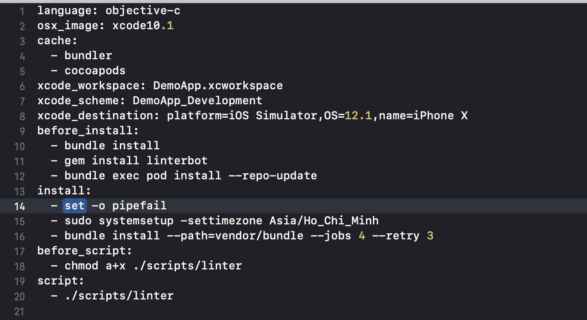
